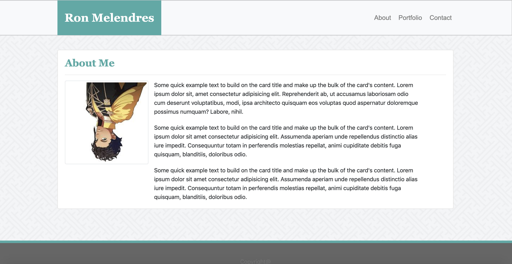

# My Portfolio Using Bootstrap

## Summary

This contains my sample profile using Bootstrap.

## Site Picture



## Technologies Used
-HTML- Creates the base structure of the three pages.

-CSS- Styles the html pages.

-Bootstrap- Provides some additional structure to the files and pages.

## Code Snipit

This snipit is used to create part of the nav bar that links to the other pages. 

```html

            <div class="collapse navbar-collapse justify-content-end" id="navbarSupportedContent">
                <ul class="nav">
                    <li class="nav-item">
                        <a class="nav-link" href="index.html">About</a>
                    </li>
                    <li class="nav-item">
                        <a class="nav-link" href="portfolio.html">Portfolio</a>
                    </li>
                    <li class="nav-item">
                        <a class="nav-link" href="contact.html">Contact</a>
                    </li>
            </div>
